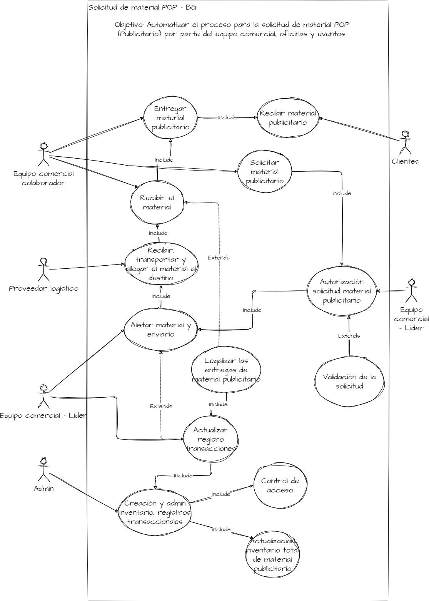
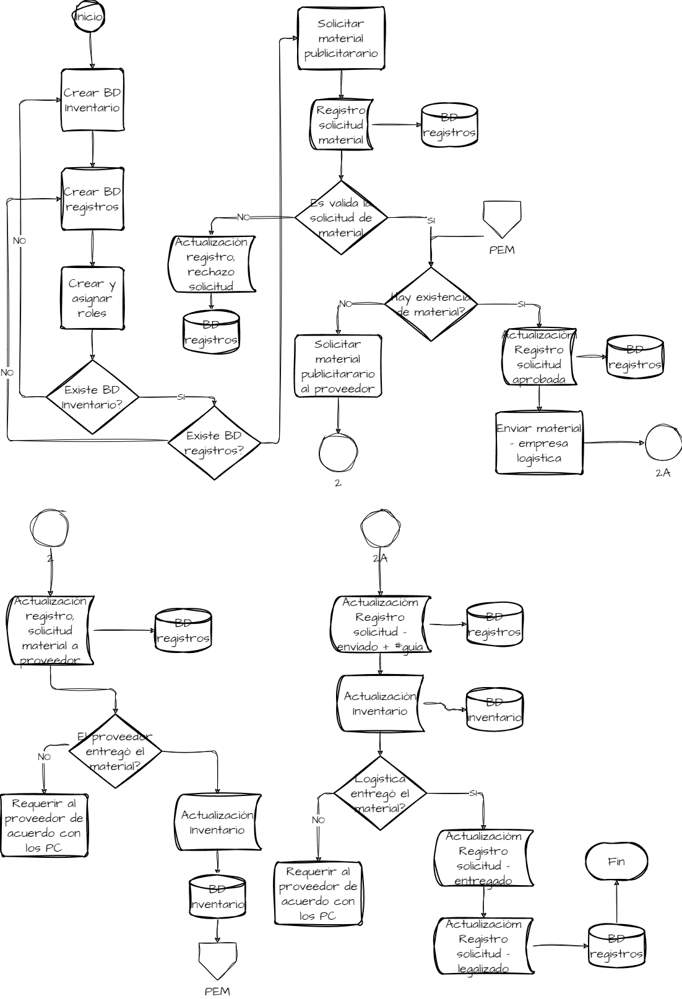
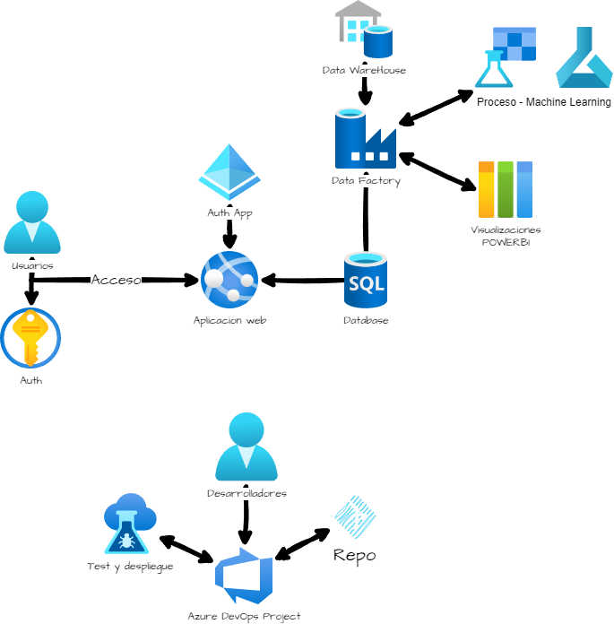

# materialPublicitarioPOP

## Descripción

Este repositorio contiene los documentos de trabajo para suplir la necesidad de Automatizar el proceso para la solicitud de material POP (Publicitario) por parte del equipo comercial, oficinas y eventos.

## Propuesta

### Casos de Uso

De acuerdo con el documento [Descripción de la necesidad](CasodeusoDesarrolladorLowCode.pdf) se desarrolló el siguiente diagrama de casos de uso:

Diagrama de casos de uso

Cada caso de uso expone una funcionalidad que se debe tratar a partir de un levantamiento de requerimientos funcionales y no funcionales.

### Diagrama de flujo de la solución

El diagrama presenta una solución abstracta a la necesidad planteada y toma en cuenta ciertas situaciones NO detalladas en el documento.

**NOTA:** Cualquier solución se debe alinear a los formatos y procedimientos del área de tecnología de la compañía.

Diagrama de flujo - propuesta solución

Junto al equipo de desarrollo se bosqueja la implementación de la solución propuesta. Metodología SCRUM.

### Arquitectura

- Se propone una solución web en primera instancia usando la nube de Microsoft Azure de la siguiente forma:  
- La autenticación de los usuarios será por los roles asignados usando Azure Identity y IAM resource Groups.
- La aplicación se desplegará en App Service. Se propone Python (framework django) o Java (framework springboot). 
- BD – Administrada en el servicio SQL Database (relacional). Dimensión inicial 2 tablas.
- Gestor de DataWarehouse, análisis y visualizaciones – Data Factory con servicios como PowerBI, machineLearning y demás a necesidad.

- Trabajo desarrollo, test y despliegue en Azure DevOps.

Arquitectura Propuesta

